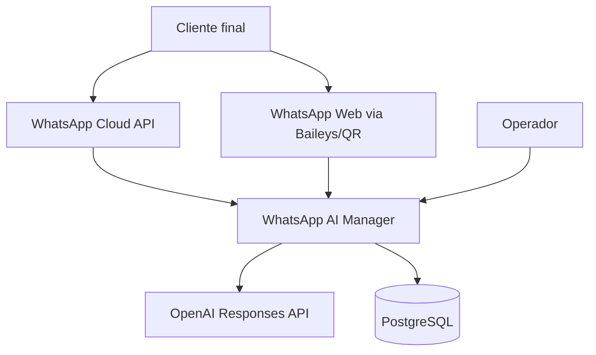
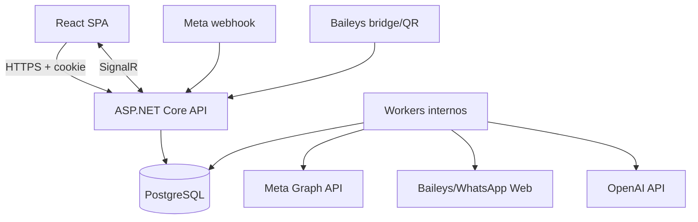
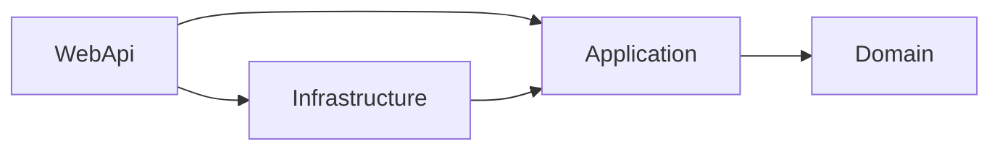
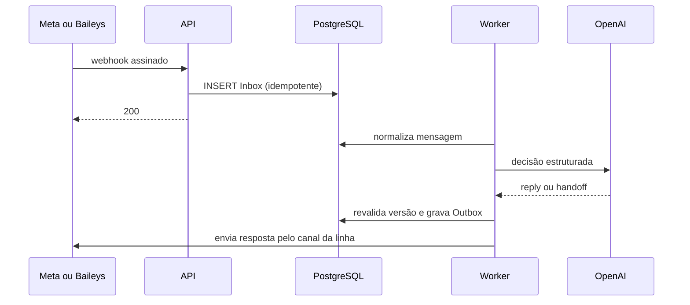

# Arquitetura do sistema

## Contexto

Meta e OpenAI são contas do tenant. O navegador nunca recebe suas credenciais.

## Containers

API e workers podem começar no mesmo processo/artefato. PostgreSQL guarda estado, Inbox e Outbox conforme ADR-0008.

## Módulos e dependências

`Domain` não referencia SDKs ou infraestrutura. `Application` define portas e casos de uso. `Infrastructure` adapta EF Core, Meta, Baileys, OpenAI e cofre. `WebApi` compõe dependências e traduz HTTP/SignalR.

## Sequência de mensagem automática

## Fronteiras de segurança

- Internet → WebApi: TLS, rate limit, tamanho máximo, autenticação apropriada por rota.
- WebApi → tenant: contexto derivado da sessão/conexão, nunca do body.
- Worker → provedores: credenciais recuperadas por referência e mantidas somente em memória pelo tempo necessário.
- SignalR: associação ao grupo ocorre no servidor após autenticação e resolução do tenant.

## Evolução condicionada

A arquitetura admite separar workers, cache ou broker, mas somente após telemetria e ADR. Nenhuma dessas possibilidades autoriza dependências antecipadas.
