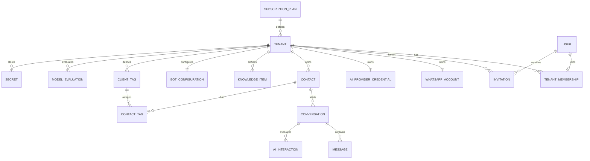

# Modelo de dados lógico

## Convenções

- Chaves primárias UUID; datas UTC; nomes físicos `snake_case`.
- Entidades tenant-owned possuem `tenant_id NOT NULL` e FK para `tenants`.
- Exclusão lógica somente quando necessária à auditoria; dados efêmeros usam expiração real.
- `row_version`/token de concorrência em agregados mutáveis críticos.

## Entidades

### Tenant

`id`, `name`, `slug`, `status`, `retention_days`, `version`, `created_at`, `suspended_at`.

Invariantes: `slug` único; status `Active|Suspended`; retenção dentro de faixa configurada.

### User e TenantMembership

`User`: `id`, `email`, `password_hash` anulável até ativação, `status`, `security_stamp`, timestamps.
`TenantMembership`: `id`, `tenant_id`, `user_id`, `role`, `status`, `version`, `created_at`, `deactivated_at`, `deactivated_by`.

Status de `User` e membership: `Invited|Active|Disabled`. Papéis: `TenantOwner|Operator`; PlatformAdmin é permissão de plataforma separada. `user_id` é único em `TenantMembership`, garantindo um tenant por usuário no MVP. Desativação rotaciona `security_stamp`; reativação nunca restaura sessão anterior (**FR-026**, **FR-028**, **BR-012**, **BR-015**).

### Invitation

`id`, `tenant_id`, `user_id`, `token_hash`, `purpose`, `expires_at`, `used_at`, `created_by`, `created_at`, `revoked_at`.

Entidade tenant-owned. Purpose: `TenantOwnerActivation|OperatorActivation`. O token aleatório em claro existe apenas na resposta de criação/reenvio; somente `token_hash` único é persistido. `expires_at = created_at + 24h`. Ativação marca `used_at` e ativa `User`/`TenantMembership` na mesma transação. Reenvio marca convites utilizáveis anteriores com `revoked_at` e cria outro token; nenhum valor em claro entra em log ou auditoria (**US-008**, **US-009**, **FR-025**, **BR-013**, **BR-014**).

### WhatsAppAccount

`id`, `tenant_id`, `waba_id`, `phone_number_id`, `display_phone_masked`, `secret_ref`, `status`, `last_tested_at`, timestamps.

Únicos: um registro ativo por tenant; `phone_number_id` globalmente único na implantação.

### PlatformIntegrationSecret

`id`, `provider`, `kind`, `secret_ref`, `status`, `rotated_at`, timestamps.

Configuração global, não tenant-owned, acessível somente pela infraestrutura. No MVP mantém as referências do `app_secret` e verify token do único Meta App; os valores nunca entram no banco em claro (**FR-004**, **FR-005**, **BR-011**).

### AiProviderCredential

`id`, `tenant_id`, `provider`, `secret_ref`, `project_ref`, `model`, `status`, `last_tested_at`, timestamps.

Não contém chave em claro. Um provedor ativo por tenant no MVP.

### Contact

`id`, `tenant_id`, `wa_contact_id`, `phone_e164_encrypted`, `phone_hash`, `display_name`, `last_seen_at`, timestamps.

Único `(tenant_id, phone_hash)`. Hash permite lookup; valor cifrado permite uso autorizado.

### Conversation

`id`, `tenant_id`, `contact_id`, `mode`, `state`, `assigned_user_id`, `service_window_expires_at`, `last_message_at`, `version`, timestamps.

Modos: `Automatic|Human|Paused`. Estado: `Open|Closed`. Índice `(tenant_id, state, last_message_at DESC)`.

### Message

`id`, `tenant_id`, `conversation_id`, `direction`, `sender_type`, `type`, `text`, `media_ref`, `media_mime_type`, `media_file_name`, `media_size_bytes`, `media_sha256`, `provider_message_id`, `status`, `failure_code`, `reply_to_id`, `occurred_at`, timestamps.

Direção: `Inbound|Outbound`. Remetente: `Customer|Human|AI|System`. Tipo inicial: `Text|Image|Document|Audio|Unsupported`. Único `(tenant_id, provider_message_id)` quando não nulo. `media_ref` é identificador interno/opaco; token e URL privada da Meta não são persistidos nem expostos ao navegador (**FR-023**).

### WebhookEvent (Inbox)

`id`, `tenant_id` anulável até resolução, `provider`, `provider_event_key`, `phone_number_id_hash`, `event_type`, `envelope_json`, `payload_ciphertext`, `payload_key_ref`, `classification`, `status`, `attempt_count`, `next_attempt_at`, `last_error_code`, `received_at`, `processed_at`.

Status: `Pending|Processing|Processed|Unknown|Dead|Ignored`. Único `(provider, provider_event_key)`, pois o Meta App é único na implantação. `envelope_json` contém somente campos operacionais allowlisted e sanitizados. O corpo original existe apenas cifrado em `payload_ciphertext`, com chave referenciada por `payload_key_ref`, acesso restrito e auditoria. Evento sem tenant resolvido permanece em quarentena e não pode criar entidades tenant-owned até resolução explícita (**FR-005**, **FR-022**, **BR-011**).

### OutboxMessage

`id`, `tenant_id`, `kind`, `aggregate_id`, `payload_json`, `idempotency_key`, `status`, `attempt_count`, `next_attempt_at`, `locked_until`, `last_error_code`, timestamps.

Único `(tenant_id, idempotency_key)`. Status: `Pending|Processing|Completed|Dead|Cancelled`.

### KnowledgeItem

`id`, `tenant_id`, `title`, `category`, `content`, `priority`, `is_active`, `version`, timestamps, `updated_by`, `deactivated_at`, `deactivated_by`.

Índice `(tenant_id, is_active, priority DESC)`; limites de quantidade e caracteres são política de aplicação. O MVP desativa e audita; não executa exclusão física (**FR-017**).

### AiInteraction

`id`, `tenant_id`, `conversation_id`, `trigger_message_id`, `conversation_version`, `provider`, `model`, `decision`, `confidence`, `handoff_reason`, `input_tokens`, `output_tokens`, `latency_ms`, `status`, `error_code`, timestamps.

Nunca persistir prompt completo, raciocínio interno, resposta bruta do provedor ou conteúdo pessoal não mascarado. Somente os metadados operacionais sanitizados enumerados acima são permitidos (**FR-016**, **NFR-008**).

### HandoffEvent

`id`, `tenant_id`, `conversation_id`, `from_mode`, `to_mode`, `reason`, `actor_type`, `actor_user_id`, `created_at`.

### UsageLedger

`id`, `tenant_id`, `provider`, `metric`, `quantity`, `unit`, `estimated_cost_minor`, `currency`, `price_version`, `source_id`, `occurred_at`.

Unidades são canônicas; custo pode ser nulo e, quando presente, é inteiro na unidade menor da moeda ISO 4217. Único por `(tenant_id, provider, metric, source_id)` quando aplicável (**FR-018**, **BR-007**, **NFR-006**).

### AuditLog

`id`, `tenant_id` anulável para plataforma, `actor_user_id`, `action`, `entity_type`, `entity_id`, `metadata_json`, `correlation_id`, `created_at`.

Somente append; metadata sanitizada. A identidade de banco usada pela aplicação não recebe permissão de `UPDATE` ou `DELETE`; correções são novos eventos relacionados (**FR-019**).

### SubscriptionPlan

`id`, `name`, `code`, `description`, `ai_enabled`, `openai_required`, `ai_metrics`, `max_operators`, `max_knowledge_items`, `is_active`, `created_at`, `updated_at`.

Planos disponíveis: `BOT` (sem IA) e `IA_BOT` (com IA). `ai_enabled` controla acesso a funcionalidades de IA. Único `code`. Seed automático na inicialização (**FR-P001**, **FR-P002**, **BR-P001**).

### BotConfiguration

`id`, `tenant_id`, `mode`, `welcome_message`, `fallback_message`, `max_tokens_per_response`, `is_active`, `version`, timestamps.

Modos: `Manual|SimpleAutoReply|AiPowered`. Configuração por tenant; `Manual` desabilita automação, `SimpleAutoReply` usa mensagem fixa, `AiPowered` usa IA com conhecimento. Versão controla concorrência otimista.

### ClientTag

`id`, `tenant_id`, `name`, `color`, `is_active`, `version`, timestamps.

Tags definidas pelo TenantOwner para categorizar contatos. Único `(tenant_id, name)`. Desativação lógica preserva histórico (**US-009**).

### ContactTag

`id`, `contact_id`, `tag_id`, `created_at`, `created_by`.

Junção entre Contact e ClientTag. Único `(contact_id, tag_id)`. Permite filtrar contatos por tag na inbox.

### ModelEvaluation

`id`, `tenant_id`, `model`, `candidate_model`, `quality_score`, `handoff_rate`, `safety_score`, `cost_per_1k_tokens`, `p95_latency_ms`, `status`, `evaluated_by`, `evaluated_at`, `approved_at`, `rejected_at`, `rollback_model`, timestamps.

Gate de promoção de modelo IA. Status: `Pending|Approved|Rejected`. Aprovação registra métricas e aprovador; rejeição registra motivo. Nenhum modelo muda sem passar pelo gate (**T057**).

### Secret

`id`, `tenant_id` anulável para segredos globais, `kind`, `encrypted_value`, `key_ref`, `status`, `rotated_at`, timestamps.

Segredos criptografados com AES-256 via `IEncryptionService`. `kind` identifica o tipo (MetaAppSecret, MetaVerifyToken, WhatsAppAccessToken, OpenAIKey). Global quando `tenant_id` é nulo; tenant-owned caso contrário. Nunca armazena valor em claro (**FR-004**, **BR-008**).

## Relacionamentos principais

## Matriz de rastreabilidade de persistência

| IDs | Entidades/garantias |
|---|---|
| **US-001, FR-002, FR-003** | `Tenant`, `User`, `TenantMembership`; criação inclui convite do proprietário e suspensão altera status sem apagar histórico. |
| **FR-001** | Sessão/antiforgery são controles WebApi; nenhum token antiforgery é persistido em entidade de negócio. |
| **FR-004, FR-021, BR-008** | `PlatformIntegrationSecret`, `WhatsAppAccount` e `AiProviderCredential` guardam apenas `secret_ref`. |
| **FR-005, FR-006, FR-007, FR-022, BR-011** | `WebhookEvent` autentica antes da resolução, deduplica, separa envelope sanitizado de payload cifrado e suporta estado `Unknown`. |
| **FR-008, BR-001, BR-002** | `WhatsAppAccount`, `Contact`, `Conversation` e `Message` têm unicidade/relacionamento tenant-scoped. |
| **FR-009** | Eventos de domínio/outbox carregam `tenant_id`; isolamento SignalR é controle de aplicação. |
| **US-003, FR-010, NFR-009** | `Message` e `OutboxMessage` nascem na mesma transação e usam chaves idempotentes. |
| **FR-011, BR-003, BR-004, BR-010, SC-004** | `Conversation.version` e `HandoffEvent` protegem corridas e registram mudança de modo. |
| **FR-012, BR-005, BR-006** | `Conversation.service_window_expires_at`, modo e Outbox sustentam bloqueio de texto/template. |
| **FR-013, FR-014, FR-015, US-004** | `KnowledgeItem`, `Conversation`, `Message` e `AiInteraction` registram apenas decisão/metadados necessários. |
| **FR-016, NFR-003, NFR-008** | `AiInteraction` guarda modelo, tokens, latência, decisão e códigos sanitizados; nunca prompt completo. |
| **FR-017, US-005** | `KnowledgeItem.version/is_active/deactivated_*` implementa edição concorrente e desativação auditável. |
| **FR-018, BR-007, US-006** | `UsageLedger` preserva unidades e custo menor inteiro com unicidade incluindo tenant. |
| **FR-019, US-007** | `AuditLog` append-only e permissões de banco impedem alteração/remoção pela aplicação. |
| **FR-020** | `Tenant.retention_days` governa jobs; auditoria preserva evidência exigida. |
| **FR-023, US-002** | `Message.media_*` guarda metadados opacos; autorização/download ocorre na WebApi. |
| **FR-024** | Cursores derivam de chaves tenant-scoped e ordenação estável de `Conversation`/`Message`. |
| **US-008, FR-025, BR-013, BR-014, SC-001** | `Invitation` guarda apenas hash, tenant/usuário/purpose, expiração, consumo, criador e revogação; senha surge somente na ativação atômica. |
| **US-009, FR-026, BR-012** | `TenantMembership` identifica Operator, estado e versão; `user_id` único impede associação a outro tenant. |
| **FR-027** | `User`, `TenantMembership` e `Tenant` fornecem o contexto sanitizado de sessão; permissões são derivadas do papel, não persistidas no cookie. |
| **FR-028, BR-015** | `User.security_stamp` e estado da membership invalidam sessões na desativação e exigem novo login após reativação. |
| **BR-009** | `WebhookEvent` e `OutboxMessage` registram tentativa, próxima execução, erro e estado morto. |
| **NFR-001, NFR-002, NFR-004, NFR-005, NFR-007** | Metas operacionais não criam entidades de domínio; evidências ficam em telemetria e runbooks sanitizados. |
| **NFR-006, SC-005** | Toda entidade tenant-owned usa `tenant_id NOT NULL`; FKs, índices e unicidades incluem/validam tenant. |
| **SC-001, SC-002, SC-003, SC-006** | Evidências são produzidas por testes/piloto; entidades acima fornecem status, timestamps e correlação. |
| **FR-P001, FR-P002, BR-P001** | `SubscriptionPlan` define planos (BOT/IA_BOT); `Tenant.plan_id` controla acesso a funcionalidades de IA. |
