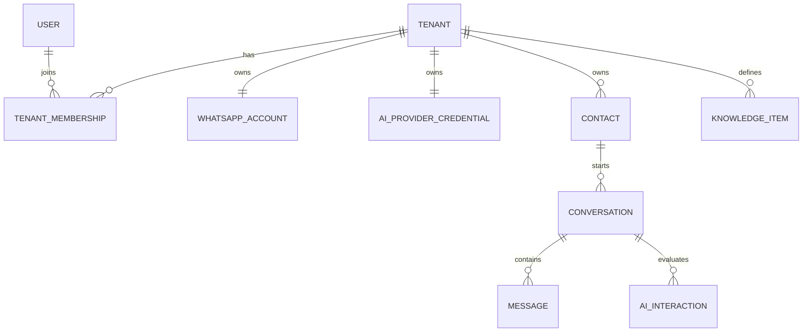

# Modelo de dados lógico

## Convenções

- Chaves primárias UUID; datas UTC; nomes físicos `snake_case`.
- Entidades tenant-owned possuem `tenant_id NOT NULL` e FK para `tenants`.
- Exclusão lógica somente quando necessária à auditoria; dados efêmeros usam expiração real.
- `row_version`/token de concorrência em agregados mutáveis críticos.

## Entidades

### Tenant

`id`, `name`, `slug`, `status`, `retention_days`, `created_at`, `suspended_at`.

Invariantes: `slug` único; status `Active|Suspended`; retenção dentro de faixa configurada.

### User e TenantMembership

`User`: `id`, `email`, `password_hash`, `status`, timestamps.  
`TenantMembership`: `tenant_id`, `user_id`, `role`, `created_at`.

Papéis: `TenantOwner|Operator`; PlatformAdmin é permissão de plataforma separada. Índice único `(tenant_id, user_id)`.

### WhatsAppAccount

`id`, `tenant_id`, `waba_id`, `phone_number_id`, `display_phone_masked`, `secret_ref`, `verify_token_ref`, `status`, `last_tested_at`, timestamps.

Únicos: um registro ativo por tenant; `phone_number_id` globalmente único na implantação.

### AiProviderCredential

`id`, `tenant_id`, `provider`, `secret_ref`, `project_ref`, `model`, `status`, `last_tested_at`, timestamps.

Não contém chave em claro. Um provedor ativo por tenant no MVP.

### Contact

`id`, `tenant_id`, `wa_contact_id`, `phone_e164_encrypted`, `phone_hash`, `display_name`, `last_seen_at`, timestamps.

Único `(tenant_id, phone_hash)`. Hash permite lookup; valor cifrado permite uso autorizado.

### Conversation

`id`, `tenant_id`, `contact_id`, `mode`, `state`, `assigned_user_id`, `service_window_expires_at`, `last_message_at`, `version`, timestamps.

Modos: `Automatic|Human|Paused`. Estado: `Open|Closed`. Índice `(tenant_id, state, last_message_at DESC)`.

### Message

`id`, `tenant_id`, `conversation_id`, `direction`, `sender_type`, `type`, `text`, `media_ref`, `provider_message_id`, `status`, `failure_code`, `reply_to_id`, `occurred_at`, timestamps.

Direção: `Inbound|Outbound`. Remetente: `Customer|Human|AI|System`. Tipo inicial: `Text|Image|Document|Audio|Unsupported`. Único `(tenant_id, provider_message_id)` quando não nulo.

### WebhookEvent (Inbox)

`id`, `tenant_id` anulável até resolução, `provider`, `provider_event_key`, `payload_json`, `status`, `attempt_count`, `next_attempt_at`, `last_error_code`, `received_at`, `processed_at`.

Status: `Pending|Processing|Processed|Dead|Ignored`. Único `(provider, provider_event_key)`. Payload deve ser sanitizado/criptografado conforme classificação.

### OutboxMessage

`id`, `tenant_id`, `kind`, `aggregate_id`, `payload_json`, `idempotency_key`, `status`, `attempt_count`, `next_attempt_at`, `locked_until`, `last_error_code`, timestamps.

Único `(tenant_id, idempotency_key)`. Status: `Pending|Processing|Completed|Dead|Cancelled`.

### KnowledgeItem

`id`, `tenant_id`, `title`, `category`, `content`, `priority`, `is_active`, `version`, timestamps, `updated_by`.

Índice `(tenant_id, is_active, priority DESC)`; limites de quantidade e caracteres são política de aplicação.

### AiInteraction

`id`, `tenant_id`, `conversation_id`, `trigger_message_id`, `conversation_version`, `provider`, `model`, `decision`, `confidence`, `handoff_reason`, `input_tokens`, `output_tokens`, `latency_ms`, `status`, `error_code`, timestamps.

Não persistir raciocínio interno. Prompt completo só sob modo de diagnóstico controlado e com retenção curta.

### HandoffEvent

`id`, `tenant_id`, `conversation_id`, `from_mode`, `to_mode`, `reason`, `actor_type`, `actor_user_id`, `created_at`.

### UsageLedger

`id`, `tenant_id`, `provider`, `metric`, `quantity`, `unit`, `estimated_cost_minor`, `currency`, `price_version`, `source_id`, `occurred_at`.

Unidades são canônicas; custo pode ser nulo. Único por `(provider, metric, source_id)` quando aplicável.

### AuditLog

`id`, `tenant_id` anulável para plataforma, `actor_user_id`, `action`, `entity_type`, `entity_id`, `metadata_json`, `correlation_id`, `created_at`.

Somente append; metadata sanitizada.

## Relacionamentos principais

## Regras de persistência rastreadas

- **FR-006/FR-007:** `WebhookEvent` é gravado e deduplicado antes da normalização.
- **FR-010:** `Message` e `OutboxMessage` nascem na mesma transação.
- **FR-011/BR-010:** `Conversation.version` protege corrida entre humano e IA.
- **FR-016/FR-018:** `AiInteraction` registra consumo; `UsageLedger` normaliza unidades.
- **NFR-006:** FKs e índices tenant-owned incluem/validam o tenant sempre que possível.
